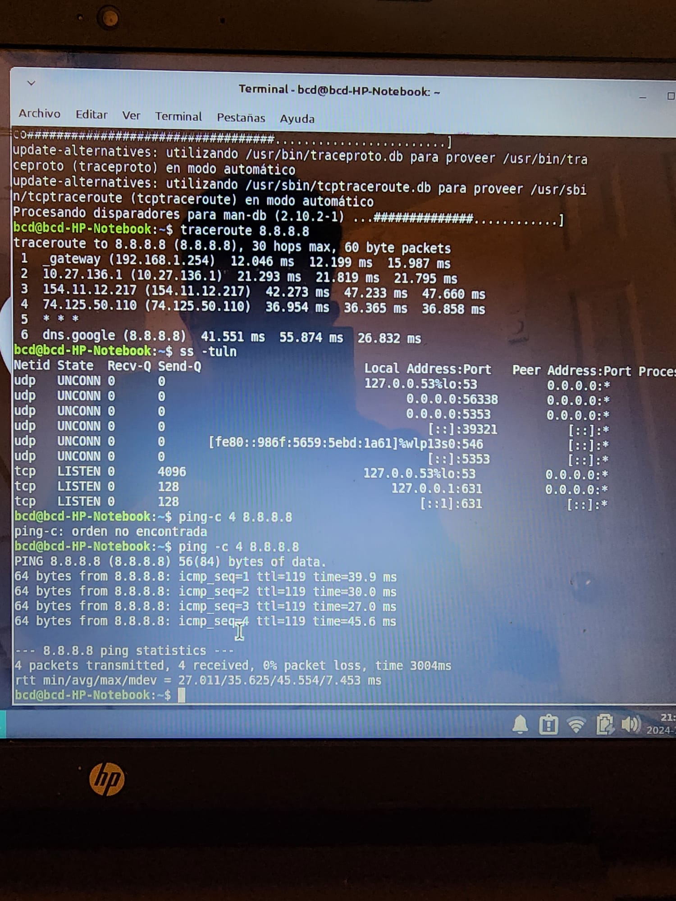
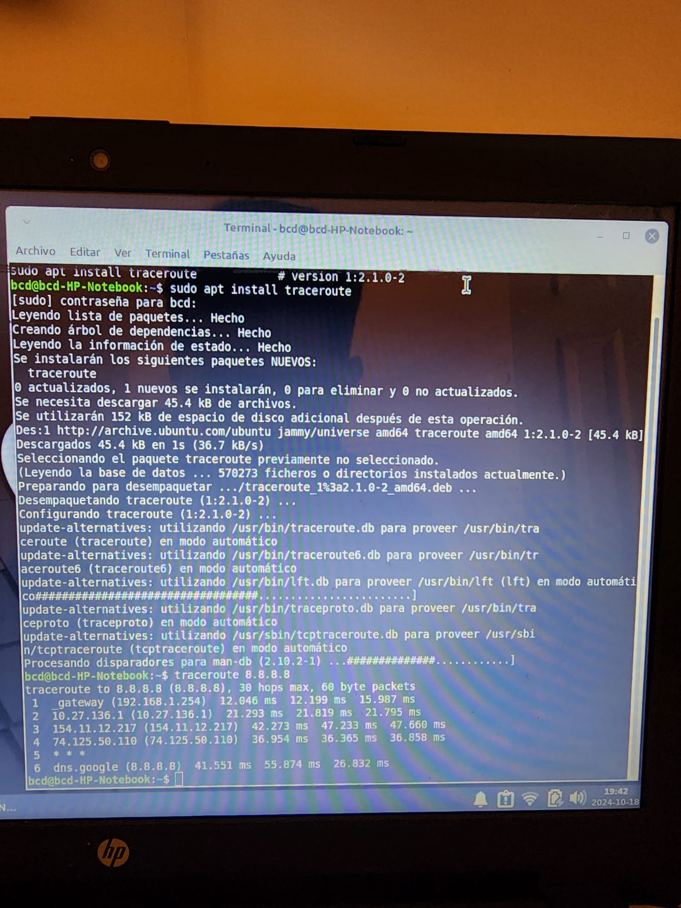
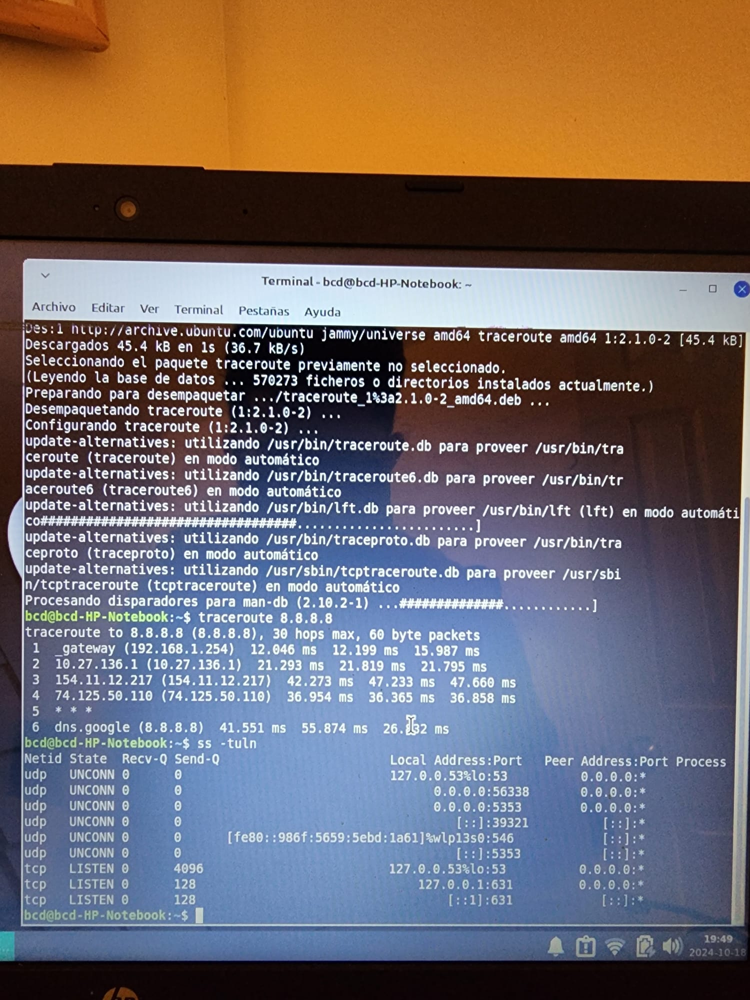

# proyect: Basic Network Connectivity Project

## Objective: This project focuses on using basic networking tools such as `ping`, `traceroute`, and `ss` to test 
network connectivity, identify potential routing issues, and view active network connections. 
my goal is to understand how to diagnose common network problems.

## Skills Demonstrated:
- Checking basic network connectivity using the `ping` command.
- Diagnosing routing issues with `traceroute`.
- Viewing open ports and connections using `ss`.

## Scenario:
I experienced intermittent network connectivity between my computer and a 
remote server. Web pages were loading slowly or not at all. I used basic network tools to determine whether 
the issue was related to my local network or if there was a problem further along the connection path.

## Commands Used:

1. Testing connectivity with `ping`: To begin troubleshooting, I used the `ping` command 
to check connectivity with Google's DNS server (8.8.8.8). also I added -c 4 to minimize the number of packets transmitted
  

2. Tracing the route with traceroute: After confirming basic connectivity, I used traceroute to 
trace the path packets took to reach 8.8.8.8 and to identify where delays might be occurring.

3. Viewing open network connections using ss:
Finally, I used the ss command to check for active network connections and open ports, confirming 
that the system was attempting to establish connections.

## conclusion:
I utilized fundamental network diagnotic tools like ping, traceroute adn ss to identify and routing issues. this tools
allowed me to understand how to diagnose problems both locally and across the breader network.
