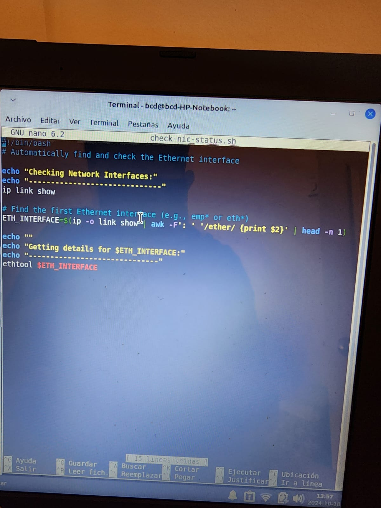
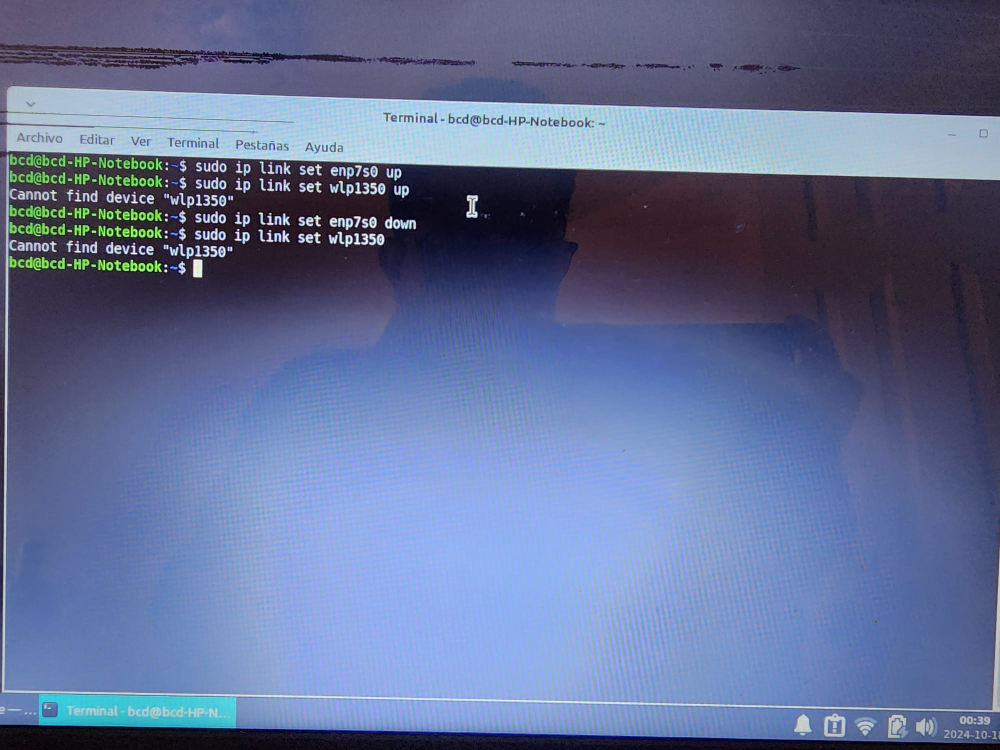

# Project: Cable Testing and Troubleshooting

The goal of this project is to learn how to test Ethernet cables, identify faults, and fix them using the appropriate tools. Additionally, I will diagnose NIC issues using Linux commands like `ip link` and `ethtool`.

## Overview
In this project, I will repair and test Ethernet cables using a cable tester and verify network connectivity.

## Tools and Commands to Use on Linux:
1. ip link show: Show network interfaces and their states.
2. ethtool (interface): View or change hardware settings on Ethernet interfaces.
3. ping & traceroute: Basic connectivity testing at the physical level.
4. Sudo ip link set ethname up/down: Bring the interface UP or DOWN.

## Steps Taken Physically:
1. Tested the cables using an Ethernet tester.
2. Re-crimped connectors using the T568B standard.
3. Verified connectivity using the `ping` command.

## Steps Taken Using Linux Tools:
1. Tested the Ethernet cable using an Ethernet cable tester.
2. Re-installed RJ45 connectors in damaged cables.
3. Used `ip link show` to check network interfaces.
4. Checked Ethernet speed using `ethtool eth0` and configured settings for auto-negotiation.

### Screenshots:

- ip link show output:
  

- Automating NIC Checks with Bash Script:
  

- Bringing Interface Up/Down:
  

- Ethtool Output:
  .jpeg)

## Automating NIC Checks with a Bash Script

I wrote a simple Bash script to automatically check the status of the network interfaces and display information using `ip link` and `ethtool`.

### Results:

By fixing faulty cables and adjusting network interfaces on Linux, I ensured stable network connectivity.

### Understanding Results After `ip link show`:

1. Output Headers:
   - `1: lo`: This is the loopback interface (used for internal communication within the system).
   - `2: enp7s0`: This is the Ethernet network interface.
   - `3: wlp1350`: This is the wireless network interface (Wi-Fi).

2. Interface Status:
   - `UP` & `DOWN`: Indicates whether the interface is active (UP) or inactive (DOWN).
   - `UNKNOWN`: Indicates that the interface is inactive, waiting to be activated.

3. MAC Addresses:
   - `link/ether`: Displays the MAC address of the interface, which is a unique identifier for each network device.

4. MTU (Maximum Transmission Unit):
   - The maximum size of packets that can be sent through the interface. Common MTU values are 1500 for Ethernet.

5. Additional Status:
   - BROADCAST/MULTICAST: Indicates that the interface can send data to multiple recipients.

## Conclusion:

Through this project, I learned how to test and repair physical network issues, while using Linux commands to verify and ensure network stability.
